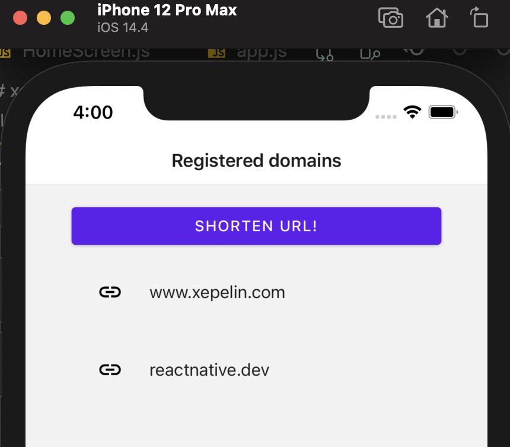
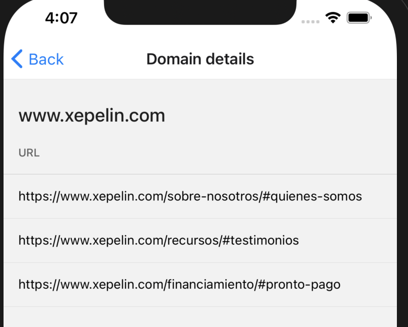
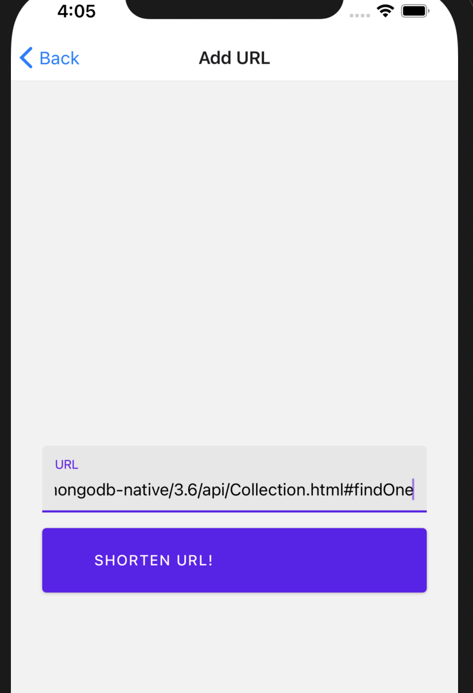
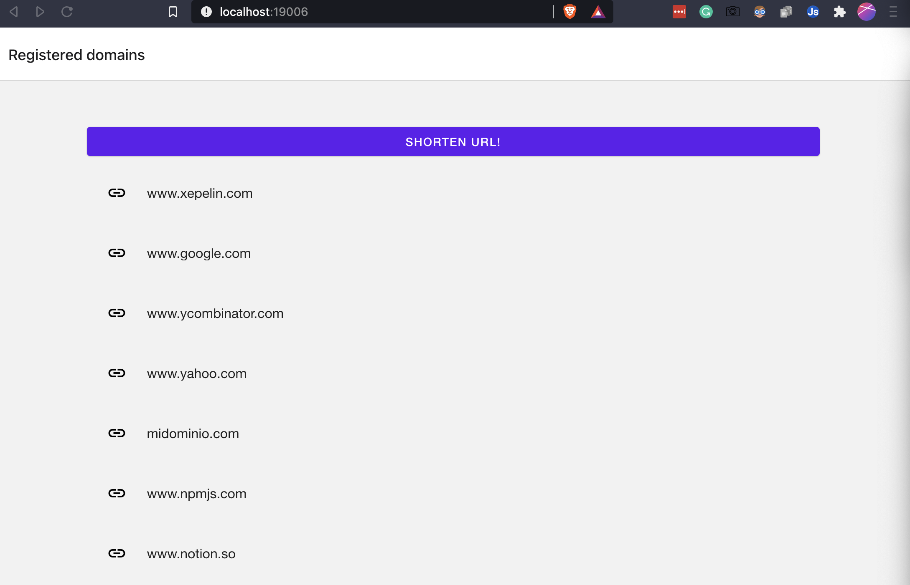

# xepelin-technical-test
 Xepelin's Technical Test

 <br>

 <br>

 <br>




Run backend (from project root)
```cd backend && node app.js```

Run frontend web (from project root)
```cd frontend && yarn web```


Run frontend iOS (from project root)
```cd frontend && yarn ios```
